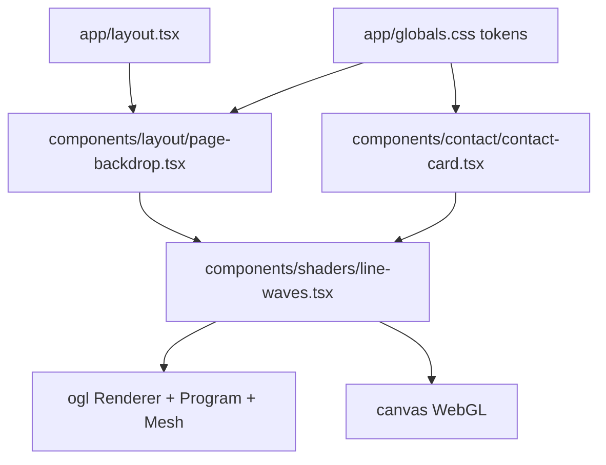
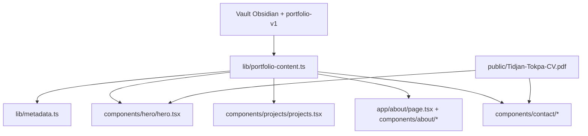

# Objectif — quoi et pourquoi

Integrer le composant React Bits `LineWaves` comme nouveau fond WebGL du portfolio Next.js, en remplacant l'effet `ShaderFlow` utilise dans le background global et dans la carte contact.

But:

- obtenir un fond anime plus proche de la direction visuelle demandee;
- conserver l'accessibilite et la lisibilite du portfolio;
- eviter toute nouvelle dependance inutile, car `ogl` est deja declare dans `package.json`.

# Stack — langages, frameworks, BDD, outils

- Next.js 16 App Router
- React 19
- TypeScript strict
- Tailwind CSS v4
- OGL/WebGL via `ogl`
- Motion pour les animations UI existantes
- Bun 1.3.14 disponible localement pour installation/verifications
- Pas de BDD

# Architecture — composants, responsabilites, interactions

Responsabilites:

- `LineWaves`: composant client TypeScript autonome qui monte un canvas WebGL, expose les props React Bits, nettoie le contexte WebGL au demontage, gere resize, visibilite et interaction souris.
- `PageBackdrop`: configure un unique `LineWaves` fixe plein viewport pour tout le front.
- `ContactCard`: ne monte plus de canvas local; elle laisse le fond global porter la signature visuelle.
- `globals.css`: ajoute seulement le style minimal du conteneur si necessaire; pas de refonte globale.

Points de failure:

- WebGL indisponible ou shader compile mal: le canvas ne doit pas casser le rendu React; garder le fond `bg-background`.
- Canvas trop couteux: limiter DPR et suspendre le rendu hors ecran ou onglet cache.
- Interaction souris: le canvas reste decoratif, `aria-hidden`, sans bloquer les controles au-dessus.

# Latency budget — identifier les chemins critiques

- Initialisation WebGL: creation renderer/program/mesh au mount, cible < 50ms sur desktop moderne.
- Animation: `requestAnimationFrame`, budget < 16.7ms/frame a 60fps.
- Resize: `ResizeObserver`, resize canvas uniquement quand la taille change; cout attendu ~1-5ms.
- Souris: traitement local en memoire ~100ns a quelques us, aucun appel reseau.
- Reseau: aucun ajout. `ogl` deja dans les dependances; si `node_modules` absent, `bun install` fera un acces registry uniquement pendant setup.
- Fond global = un seul canvas WebGL fixe plein viewport; cout borne par DPR cap, `IntersectionObserver`, `visibilitychange` et `prefers-reduced-motion`.
- Le portrait `PortraitMorph` reste un canvas distinct car il est une interaction locale photo -> illustration; il garde un fallback image statique.

# Etapes de dev — numerotees, decoupees

1. Creer `components/shaders/line-waves.tsx`.
   - Adapter le code React Bits de JSX vers TSX.
   - Typer les props.
   - Ajouter `className`.
   - Mettre les styles canvas inline ou via une classe locale dans `globals.css`.
   - Conserver cleanup: `cancelAnimationFrame`, listeners, remove canvas, `WEBGL_lose_context`.

2. Durcir le composant pour Next.js.
   - Garder `"use client"`.
   - Eviter tout acces `window/document` hors `useEffect`.
   - Ajouter un `ResizeObserver`.
   - Capper `dpr` a `Math.min(window.devicePixelRatio || 1, 1)`.
   - Suspendre le rendu si l'onglet est cache ou si le conteneur est hors ecran.

3. Integrer dans le fond global.
   - Remplacer l'import `ShaderFlow` par `LineWaves` dans `components/layout/page-backdrop.tsx`.
   - Garder la structure `aria-hidden`, `pointer-events-none`, `-z-10`, hauteur et opacites.
   - Utiliser une configuration sobre: lignes blanches, faible brightness, interaction souris desactivee si `pointer-events-none` rend l'interaction impossible.

4. Integrer dans la carte contact.
   - Remplacer `ShaderFlow` dans `components/contact/contact-card.tsx`.
   - Garder le masque radial existant.
   - Utiliser une configuration moins dense que le fond global pour eviter deux effets concurrents.

5. Nettoyer le code mort si confirme inutile.
   - Supprimer `components/shaders/shader-flow.tsx` seulement si aucun import restant.
   - Sinon le laisser intact pour eviter un changement hors scope.

6. Verifications.
   - `bun install` si `node_modules` est absent.
   - `bun run typecheck`
   - `bun run lint`
   - `bun run build`
   - Verification visuelle desktop/mobile via navigateur: canvas non vide, texte lisible, pas d'overflow horizontal, carte contact lisible en light/dark.

7. Audit et docs workflow.
   - Creer `SECURITY.md` avec audit OWASP adapte: pas d'entree utilisateur persistante, pas de secrets, liens externes inchanges, WebGL decoratif.
   - Creer `PRODUCTION.md` avec checklist pre-deploiement adaptee.
   - Ajouter une entree dans `ERRORS.log` seulement si une erreur de build/test demande correction.

# Decisions techniques — choix + alternative rejetee + pourquoi

- Choix: faire de `PageBackdrop` un fond fixe plein viewport, actif sur tout le front.
  Alternative rejetee: garder un fond limite au haut de page. Raison: le rendu donne l'impression que l'effet appartient seulement au hero, alors que la direction Octopus/Teach demande une signature visuelle globale.

- Choix: conserver un seul canvas `LineWaves` global et retirer le shader local de la carte contact.
  Alternative rejetee: dupliquer `LineWaves` dans chaque section. Raison: les notes Octopus imposent Lighthouse > 90, LCP < 2,5s, fallback WebGL et `prefers-reduced-motion`; plusieurs canvases concurrents augmentent le risque de chute FPS.

- Choix: couper `LineWaves` quand `prefers-reduced-motion: reduce` est actif.
  Alternative rejetee: continuer a animer lentement. Raison: la direction artistique Teach marque `prefers-reduced-motion` comme non negociable.

- Choix: convertir `LineWaves` en TSX dans `components/shaders/line-waves.tsx`.
  Alternative rejetee: copier le JSX brut. Raison: le repo est TypeScript strict; TSX donne des props typees et evite les `any` implicites.

- Choix: reutiliser `ogl` existant.
  Alternative rejetee: installer une nouvelle librairie shader/background. Raison: la dependance demandee est deja presente.

- Choix: integrer `LineWaves` a la place des usages `ShaderFlow` existants.
  Alternative rejetee: empiler `LineWaves` au-dessus de `ShaderFlow`. Raison: deux fonds animes superposes nuisent a la lisibilite et augmentent le cout GPU.

- Choix: reprendre les optimisations du shader actuel: DPR cap, resize observer, pause hors ecran, cleanup WebGL.
  Alternative rejetee: copier le composant React Bits sans adaptation. Raison: le composant brut anime en continu et peut couter inutilement en mobile/onglet cache.

- Choix: ne pas personnaliser les contenus du portfolio dans cette tache.
  Alternative rejetee: modifier hero/projets/about en meme temps. Raison: l'attachement demande l'integration `LineWaves`; les contenus exigent des donnees utilisateur exactes.

---

# Extension — Personnalisation portfolio depuis le vault

# Objectif — quoi et pourquoi

Remplacer le contenu template `Josh / React Bits Pro / example.com / mockups Dribbble` par les informations reelles de Tidjan Tokpa, en utilisant le vault Obsidian et `portfolio-v1` comme sources de verite.

Sources chargees:

- `/Users/teach667/Desktop/_Current_Projects/portfolio-v1/src/data/portfolioData.js`
- `/Users/teach667/Desktop/_Current_Projects/portfolio-v1/src/data/projectFilters.js`
- `/Users/teach667/Desktop/GitHub/Teach_brain-/98-Backend/Resources/Teach - Profil.md`
- `/Users/teach667/Desktop/GitHub/Teach_brain-/98-Backend/Resources/Teach - Epitech.md`
- `/Users/teach667/Desktop/GitHub/Teach_brain-/98-Backend/Resources/Teach - Skills.md`
- `/Users/teach667/Desktop/GitHub/Teach_brain-/98-Backend/Projects/CourseCircuit.md`
- `/Users/teach667/Desktop/GitHub/Teach_brain-/98-Backend/Projects/PickUp.md`
- `/Users/teach667/Desktop/GitHub/Teach_brain-/98-Backend/Projects/FrontalierPro.md`
- `/Users/teach667/Desktop/GitHub/Teach_brain-/98-Backend/Projects/Agence IT Teach.md`
- `/Users/teach667/Desktop/GitHub/Teach_brain-/98-Backend/Projects/Trashy.md`
- `/Users/teach667/Desktop/GitHub/Teach_brain-/98-Backend/Projects/Octopus Site Vitrine.md`
- `/Users/teach667/Desktop/GitHub/Teach_brain-/98-Backend/Projects/Site Agence IT.md`
- `/Users/teach667/Desktop/GitHub/Teach_brain-/98-Backend/Resources/Health Mate - Audit Code.md`
- `/Users/teach667/Desktop/GitHub/Teach_brain-/98-Backend/Resources/Build Sessions/Portfolio v1/2026-06-11-portfolio-v1-finalisation.md`
- `/Users/teach667/Desktop/_Current_Projects/PRD_FILES/Trashy/CLAUDE.md`
- `/Users/teach667/Desktop/_Current_Projects/PRD_FILES/Trashy/PLAN.md`

# Architecture — composants, responsabilites, interactions

Responsabilites:

- `lib/portfolio-content.ts`: source unique pour identite, contact, CTA, projets, experiences, formation, skills et stack.
- `lib/metadata.ts`: SEO reel, auteur, URL placeholder marquee `[UNCLEAR]` si domaine non fourni.
- `Hero`: contenu Tidjan + CTA contact/CV/GitHub + portrait reel avec transition `PortraitMorph` vers illustration.
- `PortraitMorph`: transition WebGL photo -> illustration avec image statique en fallback si WebGL est indisponible.
- `Projects`: cartes projets text-first avec stack, categorie, statut, impact et highlights; pas de mockups Dribbble.
- `About`: bio issue de `Teach - Profil.md`, experience Au Bureau + projets Epitech, education Web@cademie/Epitech.
- `Contact`: email, GitHub, LinkedIn reels; pas de lien X si non source.

# Contenu public retenu

Identite:

- Nom: Tidjan Tokpa
- Role: Developpeur Web Fullstack en alternance
- Positionnement: produits web utiles, backend rigoureux, interfaces Vue/Nest modernes, automatisation IA, culture produit
- Disponibilite: recherche alternance de 14 mois
- Rythme: 6 semaines entreprise / 2 semaines formation
- Localisation: Paris, France

Contact:

- Email: `tidjan.tokpa@epitech.eu`
- Telephone: `07-69-96-73-30`
- GitHub: `https://github.com/Scapeternam`
- LinkedIn: `https://www.linkedin.com/in/tidjan-tokpa`

Projets a afficher:

- Agence IT Teach — Agence / produit commercial — IA, automatisation, Vue/Nuxt, Next.js, Supabase
- Trash Spotter — Marketplace anti-depots sauvages — Flutter, Supabase, PostGIS, Fastify, TypeScript, Stripe Connect
- FrontalierPro — SaaS live — Base44 MVP, cible NestJS, Vue 3, Supabase, PostgreSQL, Docker
- Health Mate — IA full-stack portfolio — Next.js, Fastify, Claude API, Stripe, Docker
- CourseCircuit — Marketplace locale — Nuxt, Vue 3, Supabase, MapLibre, TypeScript
- PickUp — Marketplace livraison — React, Vite, Supabase, Stripe Connect, Twilio

# Latency budget — identifier les chemins critiques

- Contenu statique importe au build: cout memoire local ~100ns, pas d'appel reseau runtime.
- Images projet: aucune image externe tant que les assets ne sont pas fournis; suppression du cout `cdn.dribbble.com`.
- CV PDF: fichier statique public, servi par Next; cout reseau uniquement au clic.
- Cartes projets text-first: rendu React statique, pas de requete DB/API.
- Si filtres projets/stacks ajoutes dans une passe suivante: filtrage local O(n) sur 6 projets, cout negligeable.

# Etapes de dev — numerotees, decoupees

1. Creer `lib/portfolio-content.ts`.
   - Centraliser toutes les donnees publiques.
   - Typer les objets `Project`, `Experience`, `Education`, `SkillGroup`, `StackItem`.
   - Marquer explicitement `[UNCLEAR]` seulement pour les donnees absentes, sans inventer.

2. Remplacer les placeholders globaux.
   - Mettre a jour `lib/metadata.ts`.
   - Supprimer `example.com`, `Your Name`, `@yourhandle`, `Portfolio` generique.
   - Utiliser `Tidjan Tokpa` et une description portfolio reelle.

3. Personnaliser Hero + CTA.
   - Remplacer `Josh` par Tidjan.
   - Ajouter role, tagline, disponibilite et rythme.
   - Ajouter CTA contact, CV, GitHub.
   - Remplacer le portrait fake par les deux assets reels fournis: photo et illustration.

4. Personnaliser projets.
   - Remplacer le tableau mock par les 6 projets reels.
   - Retirer les URLs Dribbble.
   - Adapter la carte en version text-first: icon, type, statut, stack badges, impact, highlights.
   - Garder un layout responsive sans nested cards.

5. Personnaliser About / Experience / Education / Skills / Stack.
   - Bio issue de `Teach - Profil.md`.
   - Experience: Connect In, My Cinema, Manager Au Bureau.
   - Education: Web@cademie by Epitech, certification Claude Code.
   - Stack/skills: niveaux reels de `Teach - Skills.md`, sans survente.

6. Personnaliser Contact.
   - Email public reel.
   - LinkedIn/GitHub reels.
   - Retirer X si non source.
   - Remplacer `By React Bits Pro`.

7. Assets.
   - Copier `Tidjan-Tokpa-CV.pdf` depuis `portfolio-v1/public/` vers `portfolio-v2/public/`.
   - Ajouter les portraits publics fournis par l'utilisateur: `tidjan-portrait-photo.jpg` et `tidjan-portrait-illustration.png`.
   - Ne pas ajouter d'image projet inventee.

8. Tests et audit.
   - Ajouter/adapter tests unitaires sur le contenu centralise.
   - Verifier absence des placeholders: `Josh`, `React Bits Pro`, `example.com`, URLs Dribbble.
   - Lancer `bun run test`, `bun run typecheck`, `bun run lint`, `bun run build`.
   - Verification visuelle desktop/mobile dans le navigateur.
   - Mettre a jour `SECURITY.md`, `PRODUCTION.md`, `ERRORS.log` si necessaire.

# Decisions techniques — choix + alternative rejetee + pourquoi

- Choix: source unique `lib/portfolio-content.ts`.
  Alternative rejetee: remplacer les textes directement dans chaque composant. Raison: evite la divergence et facilite la maintenance.

- Choix: portrait hero avec assets reels fournis et cartes projets sans images tant que les screenshots reels ne sont pas fournis.
  Alternative rejetee: conserver les mockups Dribbble ou le portrait anime du template. Raison: un portfolio personnel ne doit pas afficher de faux visuels.

- Choix: utiliser `portfolio-v1` comme contenu canonique et le vault comme verification.
  Alternative rejetee: reconstruire le contenu uniquement depuis notes brutes. Raison: `portfolio-v1` contient deja une version publique confirmee et testee.

- Choix: pre-tester WebGL avant d'appeler `ogl.Renderer`.
  Alternative rejetee: laisser `ogl` tenter l'initialisation directement. Raison: `ogl` ecrit une erreur console quand aucun contexte WebGL n'est disponible, ce qui ouvre l'overlay Next en dev au lieu de garder un fallback decoratif.

- Choix: garder le hero visible au premier rendu sans wrapper Motion initialement en `opacity: 0`.
  Alternative rejetee: conserver l'animation d'entree sur le texte et la carte portrait. Raison: en verification mobile headless, l'etat initial pouvait produire un premier viewport vide avant hydratation; le morphing photo -> illustration reste preserve dans `PortraitMorph`.

- Choix: ne pas commit.
  Alternative rejetee: commit agent automatique. Raison: preference utilisateur explicite du 2026-07-05.
