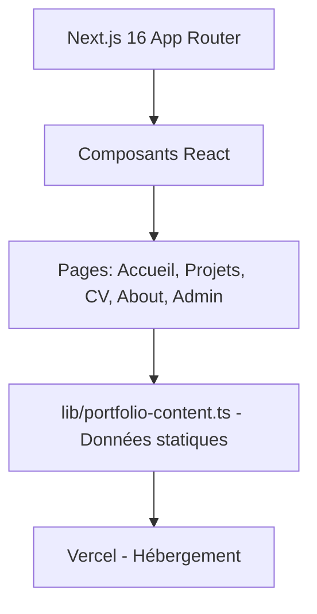
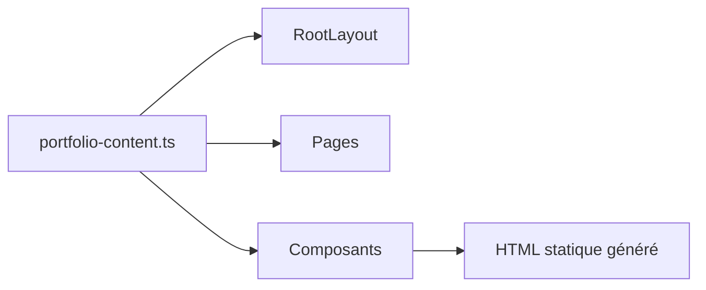
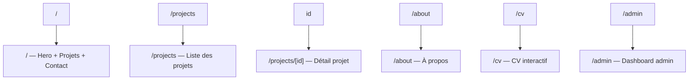

# Architecture — Portfolio v2

## Vue d'Ensemble

## Composants
### Frontend
- **Framework** : Next.js 16 (App Router)
- **UI Library** : Tailwind CSS 4 + motion (animations)
- **State Management** : Aucun (données statiques depuis `lib/portfolio-content.ts`)
- **Rendering** : SSG (Static Site Generation) via Next.js
- **3D/WebGL** : OGL (OpenGL abstractions légères)

### Backend
- **API** : Route `app/api/admin/route.ts` (GET/POST) — admin dashboard
- **Authentification** : Client-side password check (`bento`)
- **Middleware** : CSP, rate limiting à ajouter

### Base de Données
- **Type** : Aucune base de données — tout est statique
- **Contenu** : Données dans `lib/portfolio-content.ts` (projets, expérience, stack, etc.)

## Flux de Données

## Décisions Techniques
| Décision | Justification | Alternatives Rejetées |
|----------|---------------|-----------------------|
| Next.js 16 (pas statique pur) | SSR pour SEO, App Router pour performance | Nuxt (moins adapté pour portfolio simple), Gatsby (déprécié) |
| Données statiques dans un fichier TS | Pas besoin de CMS, déploiement simple, zéro latence | Strapi (overkill), Markdown/MDX (complexité inutile pour ce volume) |
| OGL plutôt que Three.js vanilla | Plus léger, optimisé pour le web, meilleure DX | Three.js vanilla (plus lourd), R3F (overkill) |
| Vercel pour l'hébergement | Natif Next.js, déploiement automatique, GitHub Student | GitHub Pages (incompatible avec SSR/API routes) |

## Invariants
- Toutes les données sont dans `lib/portfolio-content.ts` — pas de fetch externe
- Le site doit fonctionner sans JavaScript (graceful degradation)
- Les pages légales sont accessibles depuis le footer

## Dépendances Externes
| Service | Usage | Lien |
|---------|-------|------|
| Vercel | Hébergement | `https://vercel.com` |
| Name.com | Domaine `scapeternam.dev` | `https://name.com` |

## Schéma des Routes

## Sécurité
- **CSP** : À implémenter via middleware Next.js
- **Rate Limiting** : À implémenter sur `/admin` et formulaire contact
- **Secrets** : Aucun stocké dans le code (admin password côté client uniquement)
- **HTTPS** : Géré par Vercel
